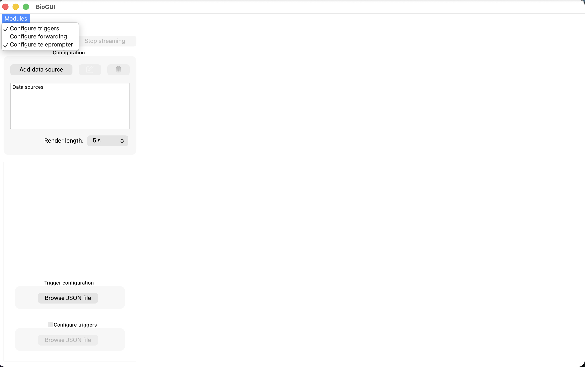

This document is intended to make users familiar with the graphical user interface (GUI) of BioGUI.

# Graphical User Interface

The BioGUI revolves around a main window, which contains all the essential components for signal acquisition and visualization. The figure below shows the main window layout:

## Main Window

The main window consists of mainly three sub-components:

- **Configuration Panel**: This panel, hilighted in blue in the figure above, allows users to add and configure different acquisition interfaces.

- **Signal Visualization Area**: This area, hilighted in orange in the figure above, displays the real-time plots of the acquired signals.

- **Scrollable Area**: This area, hilighted in green in the figure above, is scrollable and contains the [Modules](#modules) that can be added to the GUI for additional functionalities.

## Modules

Modules are additional components that can be added to the BioGUI to extend its functionalities. To see the available modules, click on the `Modules` button located at the top-left corner of the main window. 

When clicked, the new module will appear in the scrollable area of the main window. When a module is added, a tick will appear next to its name in the modules list, indicating that it is currently active. To remove it, simply click on its name again in the modules list.

The currently available modules are:

- **Trigger**: Displays visual stimuli and sends trigger signals during experiments. Configurable via JSON to define trigger labels, durations, images, and rest periods with countdowns. [Learn more](modules/trigger.md)

- **Forwarding**: Forwards acquired signals to external servers via TCP or Unix sockets. Allows selecting specific signals with configurable window length and stride. [Learn more](modules/forwarding.md)

- **Teleprompter**: Loads sentences from a JSON file and displays them with word highlighting. Supports both voiced and silent reading modes with configurable rest periods. [Learn more](modules/teleprompter.md) 
